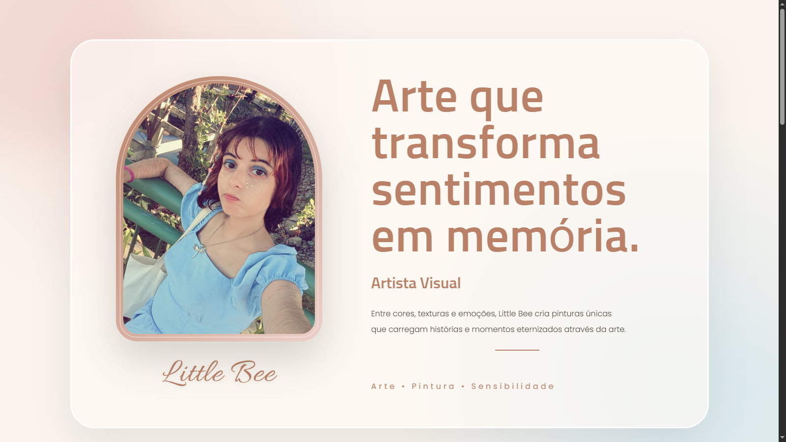
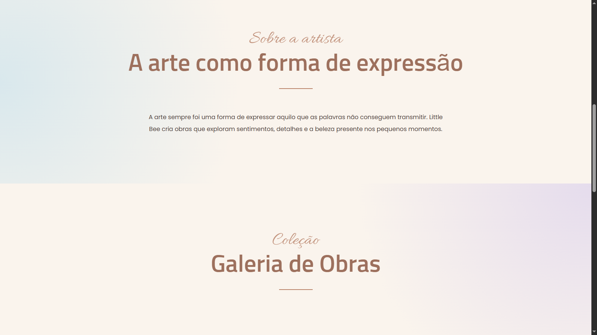
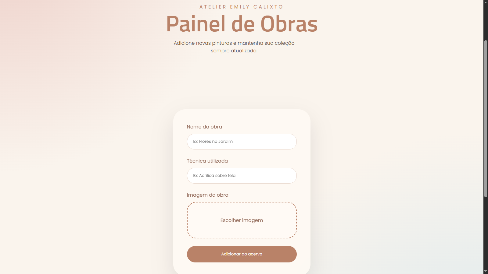
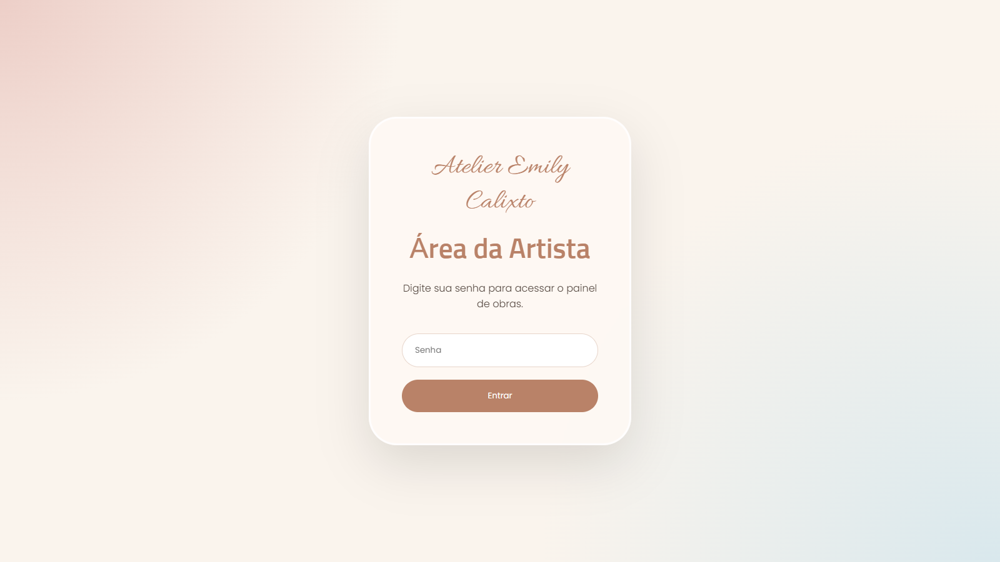
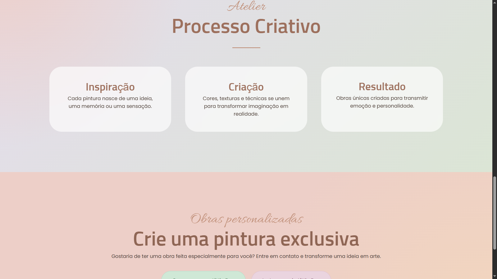
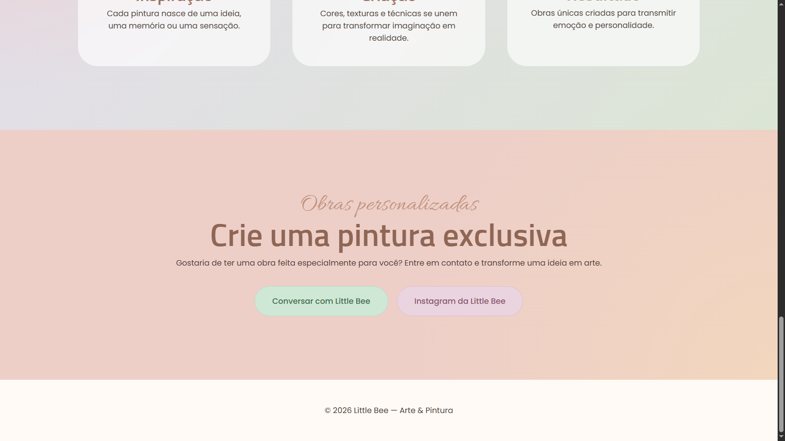

# 🎨 Little Bee — Arte & Pintura

> Portfólio artístico e galeria virtual desenvolvido para apresentar o trabalho da artista visual **Emily Calixto**, utilizando a identidade artística **Little Bee**.

O projeto combina uma landing page responsiva, galeria dinâmica conectada ao Supabase, painel administrativo protegido por autenticação e armazenamento de imagens. A aplicação possui duas camadas de execução: uma implementação Node.js/Express para desenvolvimento local e uma implementação Cloudflare Worker para o ambiente publicado.

---

## 📌 Visão geral

O **Little Bee — Arte & Pintura** foi pensado como uma aplicação web real para resolver um problema simples: permitir que uma artista apresente seu trabalho profissionalmente na internet e consiga manter o próprio acervo atualizado sem editar o código-fonte a cada nova obra.

A aplicação é dividida conceitualmente em quatro áreas:

1. **Experiência pública** — apresentação da artista, identidade visual, processo criativo, galeria e contatos.
2. **Galeria dinâmica** — obras carregadas da tabela `pinturas` do Supabase.
3. **Área administrativa** — login, cadastro, edição e exclusão de obras.
4. **Infraestrutura de produção** — Cloudflare Workers + Workers Assets + Supabase Database + Supabase Storage.

A arquitetura atual mantém o front-end estático separado da lógica de API e do armazenamento dos dados. Isso permite que a interface seja servida como assets enquanto o Worker intercepta somente as rotas que precisam de processamento no servidor.

---

# 📸 Preview

## Página inicial



## Galeria e apresentação



## Painel administrativo



## Tela de autenticação



## Processo criativo



## Contatos e encomendas



> As imagens acima utilizam os **mesmos caminhos relativos que já existiam no README**, preservando os assets atuais do repositório.

---

# ✨ Funcionalidades

## 🌐 Experiência pública

### Hero / apresentação

A página inicial apresenta a identidade da Little Bee com:

- fotografia da artista;
- assinatura visual `Little Bee`;
- título principal;
- descrição da proposta artística;
- categorias relacionadas ao trabalho;
- composição visual baseada em cores pastel, formas orgânicas e tipografia artística.

### Seção “Sobre a artista”

Apresenta a proposta da artista e utiliza uma seção independente para contextualizar sua produção visual.

### Galeria dinâmica

A galeria não depende de obras codificadas diretamente no HTML. O `script.js` realiza uma requisição para:

```text
GET /api/pinturas
```

O retorno é utilizado para construir os cards da galeria em tempo de execução.

Cada obra possui, no mínimo:

- `id`
- `titulo`
- `tecnica`
- `imagem`

O JavaScript cria os elementos do card usando `document.createElement()` e adiciona título e técnica com `textContent`.

### Visualização ampliada

Ao clicar na imagem de uma obra, a aplicação abre um modal e utiliza a URL da imagem selecionada para exibição em tamanho maior.

### Animações de entrada

O projeto utiliza a **Intersection Observer API** para observar elementos da interface e adicionar a classe `mostrar` quando eles entram na área visível da página.

Isso permite animações sem depender de uma biblioteca externa de animação.

### Processo criativo

A landing page possui uma seção dedicada ao fluxo conceitual do trabalho artístico:

- Inspiração;
- Criação;
- Resultado.

### Encomendas personalizadas

A seção de encomendas permite que visitantes entrem em contato diretamente com a artista.

Atualmente existem dois canais principais:

- WhatsApp;
- Instagram.

### SEO e compartilhamento

O `index.html` possui metadados para mecanismos de busca e compartilhamento social, incluindo:

- `title`;
- `description`;
- `author`;
- Open Graph (`og:title`, `og:description`, `og:image`, `og:type`, `og:site_name`);
- Twitter/X Cards (`twitter:card`, `twitter:title`, `twitter:description`, `twitter:image`);
- favicon.

A imagem Open Graph utilizada atualmente aponta para o asset público `header.png`.

---

# 🔐 Área administrativa

A área administrativa foi construída para que a artista possa manter o acervo sem alterar manualmente o código do site.

## Login

A página `login.html` possui um formulário simples de autenticação.

O `login.js` envia a senha para:

```text
POST /login
```

O Worker de produção valida a senha configurada em `SENHA_ADMIN` e cria um cookie de sessão assinado quando a autenticação é bem-sucedida.

### Comportamento de erro

Quando a senha está incorreta:

- a mensagem de erro é exibida;
- o campo recebe a classe visual de erro;
- o foco retorna ao campo de senha.

---

# 🧑‍🎨 Gerenciamento de obras

O painel administrativo (`admin.html` + `admin.js`) implementa um CRUD de obras.

## ➕ Cadastro

Endpoint:

```http
POST /api/pinturas
```

O formulário envia:

```text
titulo
tecnica
imagem
```

A imagem é enviada como `multipart/form-data`.

No ambiente Cloudflare Worker, o arquivo é convertido em `ArrayBuffer` e enviado para o bucket `obras` do Supabase Storage.

Depois do upload, o sistema obtém a URL pública do arquivo e grava essa URL junto ao registro da pintura.

## ✏️ Edição

Endpoint:

```http
PUT /api/pinturas/:id
```

A edição permite alterar:

- título;
- técnica;
- imagem.

Se uma nova imagem for enviada, o sistema:

1. localiza a obra atual;
2. valida o novo arquivo;
3. envia a nova imagem ao Storage;
4. obtém a nova URL pública;
5. atualiza o registro no banco;
6. tenta remover a imagem anterior.

Se nenhuma nova imagem for selecionada, a imagem existente é mantida.

## 🗑️ Exclusão

Endpoint:

```http
DELETE /api/pinturas/:id
```

O sistema primeiro localiza a obra e tenta remover o arquivo correspondente do Storage. Em seguida, remove o registro da tabela `pinturas`.

## 👁️ Preview de upload

O painel utiliza `URL.createObjectURL()` para mostrar uma prévia local da imagem antes do envio.

Durante a edição, a imagem atualmente cadastrada também pode ser carregada como preview.

---

# 🛡️ Segurança

## Sessão assinada no Cloudflare Worker

A implementação de produção não utiliza `express-session`. O `worker.js` implementa uma sessão stateless baseada em HMAC-SHA-256.

O fluxo é:

```text
Senha correta
    │
    ▼
Date.now() + crypto.randomUUID()
    │
    ▼
HMAC-SHA-256 com SESSION_SECRET
    │
    ▼
valor.assinatura
    │
    ▼
Cookie HttpOnly
```

O cookie é criado com:

```text
Path=/
HttpOnly
Secure
SameSite=Strict
Max-Age=86400
```

O token contém um identificador formado por timestamp + UUID e uma assinatura HMAC. Na validação, o Worker separa o valor da assinatura pelo último ponto do token e recalcula a assinatura.

## Proteção do painel

A rota:

```text
/admin.html
```

é interceptada pelo Worker antes que o asset seja servido.

Sem uma sessão válida, o usuário recebe:

```http
302 Found
Location: /login.html
```

Com uma sessão válida, o Worker permite que o request continue para `env.ASSETS.fetch(request)`.

## Proteção das APIs administrativas

As operações de escrita também exigem sessão válida:

```text
POST   /api/pinturas
PUT    /api/pinturas/:id
DELETE /api/pinturas/:id
```

Uma requisição sem autenticação recebe:

```http
401 Unauthorized
```

Já a consulta pública:

```text
GET /api/pinturas
```

permanece disponível para alimentar a galeria.

## Validação de imagens

O Worker restringe os uploads aos tipos:

```text
image/jpeg
image/png
image/webp
```

Também existe limite de:

```text
5 MB por imagem
```

O nome final do arquivo não utiliza diretamente o nome enviado pelo usuário. O sistema gera um nome baseado em timestamp, reduzindo problemas relacionados a nomes de arquivo arbitrários.

## Segredos

As configurações sensíveis são obtidas por variáveis de ambiente/Secrets, incluindo:

```text
SENHA_ADMIN
SESSION_SECRET
SUPABASE_URL
SUPABASE_ANON_KEY
```

O `.gitignore` exclui `.env` do controle de versão.

> O repositório não deve receber senhas, tokens privados ou outros secrets.

---

# ☁️ Arquitetura de produção

A versão publicada utiliza **Cloudflare Workers** como camada de execução.

O `wrangler.toml` define:

```toml
name = "pagina-de-artes-visuais"
main = "worker.js"
compatibility_date = "2026-08-24"
```

Os arquivos da pasta `public/` são configurados como assets:

```toml
[assets]
directory = "./public"
binding = "ASSETS"
```

O `run_worker_first` direciona as seguintes rotas para processamento pelo Worker:

```text
/login
/logout
/api/*
/admin.html
```

Isso cria uma separação clara entre:

```text
Browser
   │
   ▼
Cloudflare Worker
   │
   ├── /login
   ├── /logout
   ├── /api/*
   └── /admin.html
          │
          ▼
     ASSETS / public

Worker ───────────────► Supabase
                          ├── Database
                          └── Storage
```

---

# 🧱 Arquitetura completa

## Produção — Cloudflare

```text
                         ┌─────────────────────┐
                         │      Navegador      │
                         └──────────┬──────────┘
                                    │
                                    ▼
                         ┌─────────────────────┐
                         │ Cloudflare Worker   │
                         │     worker.js       │
                         └──────┬───────┬──────┘
                                │       │
                    rotas API   │       │ assets
                                │       │
                                ▼       ▼
                       ┌────────────┐ ┌──────────────┐
                       │  Supabase  │ │ Workers      │
                       │            │ │ Assets       │
                       │ DB +       │ │ ./public     │
                       │ Storage    │ └──────────────┘
                       └────────────┘
```

## Desenvolvimento local — Node.js

O projeto também mantém uma implementação Express em `server.js`:

```text
Browser
   │
   ▼
Express / Node.js
   │
   ├── sessão
   ├── login
   ├── rate limit
   ├── Helmet
   ├── API REST
   ├── Multer
   │
   ├──────────────► database/database.js
   │                       │
   │                       ▼
   │                  Supabase DB
   │
   └──────────────► supabase/supabase.js
                           │
                           ▼
                      Supabase Storage
```

A existência das duas implementações é importante: **`server.js` representa o ambiente Node/Express local, enquanto `worker.js` é a camada compatível com o deployment atual em Cloudflare Workers.**

---

# 🔌 API REST

| Método | Rota | Autenticação | Função |
|---|---|---|---|
| `POST` | `/login` | Pública | Autentica o administrador e cria sessão |
| `GET` | `/logout` | Sessão | Remove a sessão |
| `GET` | `/api/pinturas` | Pública | Lista as obras |
| `POST` | `/api/pinturas` | Admin | Cria uma obra |
| `PUT` | `/api/pinturas/:id` | Admin | Edita uma obra |
| `DELETE` | `/api/pinturas/:id` | Admin | Exclui uma obra |
| `GET` | `/admin.html` | Admin | Acessa o painel protegido |

A implementação Express ainda possui a rota de diagnóstico:

```http
GET /api/teste
```

que retorna uma confirmação simples de funcionamento da API local.

---

# 🗄️ Persistência e armazenamento

## Supabase Database

A tabela utilizada pela aplicação é:

```text
pinturas
```

Com os dados consumidos pelo projeto:

```text
id
 titulo
 tecnica
 imagem
```

O módulo `database/database.js` encapsula as operações de persistência:

```text
listarPinturas()
buscarPintura(id)
criarPintura(titulo, tecnica, imagem)
editarPintura(id, titulo, tecnica, imagem)
apagarPintura(id)
```

Essa camada evita espalhar operações do banco pelo front-end e organiza a lógica de persistência da versão Express.

## Supabase Storage

O bucket utilizado para as obras é:

```text
obras
```

O fluxo de imagem é:

```text
Upload
   │
   ▼
Supabase Storage / obras
   │
   ▼
URL pública
   │
   ▼
Tabela pinturas.imagem
```

Assim, o banco guarda a referência da imagem, enquanto o arquivo permanece no Storage.

---

# 🎨 Front-end

## HTML

A interface é construída com HTML5 sem framework de componentes.

Principais páginas:

- `index.html` — página pública;
- `login.html` — autenticação;
- `admin.html` — gerenciamento do acervo.

## CSS

O `styles.css` centraliza a identidade visual do projeto e utiliza variáveis CSS para a paleta:

```css
--creme
--papel
--texto
--dourado
--terracota
--rosa
--rosa-claro
--azul
--lavanda
--verde
--pessego
```

A interface utiliza:

- grids responsivos;
- cards;
- gradientes radiais;
- formas orgânicas;
- `backdrop-filter`;
- sombras;
- transições;
- hover states;
- modal;
- composição tipográfica com Google Fonts.

As fontes utilizadas incluem famílias como **Allura**, **Sunflower**, **Poppins** e **Cormorant Garamond** em diferentes telas.

## JavaScript vanilla

Não existe framework como React, Vue ou Angular no front-end.

O projeto trabalha diretamente com:

- DOM API;
- Fetch API;
- FormData;
- Intersection Observer API;
- `URL.createObjectURL()`;
- eventos de clique e submit.

Essa escolha reduz a quantidade de dependências e mantém a aplicação adequada ao seu escopo.

---

# 📱 PWA / instalação no celular

O projeto possui `public/manifest.json`, permitindo que navegadores compatíveis reconheçam a aplicação como instalável.

Configurações atuais:

```json
{
  "short_name": "Little Bee",
  "start_url": "/login.html",
  "display": "standalone",
  "orientation": "portrait"
}
```

O manifesto utiliza o ícone:

```text
/icons/icon-512.png
```

Isso permite criar uma experiência semelhante a um aplicativo ao adicionar o site à tela inicial de um dispositivo compatível.

---

# 📁 Estrutura do projeto

```text
paginaDeArtesVisuais/
│
├── database/
│   └── database.js
│       └── Camada de acesso ao Supabase Database
│
├── public/
│   ├── icons/
│   │   └── icon-512.png
│   │
│   ├── img/
│   │   ├── admin.png
│   │   ├── contatos.png
│   │   ├── header.png
│   │   ├── icons8-bee-100.png
│   │   ├── lb.jpeg
│   │   ├── login.png
│   │   ├── processo.png
│   │   └── sobre.png
│   │
│   ├── admin.html
│   ├── admin.js
│   ├── index.html
│   ├── login.html
│   ├── login.js
│   ├── manifest.json
│   ├── script.js
│   └── styles.css
│
├── supabase/
│   └── supabase.js
│       └── Inicialização do cliente Supabase
│
├── .gitignore
├── package.json
├── package-lock.json
├── server.js
├── worker.js
├── wrangler.toml
└── README.md
```

O repositório também contém estado de desenvolvimento gerado pelo Wrangler em `.wrangler/`. Esse diretório é infraestrutura local gerada pela ferramenta e não participa da arquitetura funcional da aplicação publicada.

---

# 📄 Descrição dos principais arquivos

| Arquivo | Responsabilidade |
|---|---|
| `public/index.html` | Estrutura da página pública, SEO, Open Graph, Twitter Card e conteúdo institucional |
| `public/styles.css` | Identidade visual e layout de todas as telas |
| `public/script.js` | Galeria dinâmica, modal e animações de entrada |
| `public/login.html` | Interface de autenticação |
| `public/login.js` | Comunicação do login com a API |
| `public/admin.html` | Interface do painel administrativo |
| `public/admin.js` | CRUD visual das obras e preview de imagens |
| `public/manifest.json` | Configuração de instalação/PWA |
| `server.js` | Servidor Node.js/Express para execução local |
| `worker.js` | Worker de produção para Cloudflare |
| `wrangler.toml` | Configuração do deployment Cloudflare |
| `supabase/supabase.js` | Criação do cliente Supabase no ambiente Node |
| `database/database.js` | Operações CRUD no banco Supabase |
| `.gitignore` | Exclusão de dependências, secrets e diretórios de build |
| `package.json` | Dependências e scripts do projeto |

---

# 📦 Dependências

O `package.json` atualmente utiliza:

### Runtime

- `@supabase/supabase-js` — integração com Supabase;
- `express` — servidor HTTP/API local;
- `multer` — processamento de uploads multipart no Express;
- `express-session` — sessões na implementação local;
- `express-rate-limit` — limitação de tentativas de login no Express;
- `helmet` — headers de segurança no Express;
- `dotenv` — carregamento das variáveis de ambiente;
- `sqlite3` — dependência presente no projeto para a camada de desenvolvimento original.

### Desenvolvimento/deployment

- `wrangler` — CLI utilizada para desenvolvimento e deployment do Cloudflare Worker;
- `@cloudflare/workers-types` — tipos relacionados ao ambiente Workers.

---

# ⚙️ Configuração local

## 1. Clonar

```bash
git clone https://github.com/Richter06/paginaDeArtesVisuais.git
cd paginaDeArtesVisuais
```

## 2. Instalar dependências

```bash
npm install
```

## 3. Criar `.env`

Na raiz:

```env
SENHA_ADMIN=sua_senha
SESSION_SECRET=seu_segredo
SUPABASE_URL=sua_url
SUPABASE_ANON_KEY=sua_chave_anon
```

O arquivo `.env` está excluído pelo `.gitignore`.

## 4. Rodar o Express

```bash
npm start
```

Por padrão:

```text
http://localhost:3000
```

Login:

```text
http://localhost:3000/login.html
```

---

# ☁️ Deployment Cloudflare

O deployment atual utiliza Wrangler.

Com as credenciais e secrets configurados no ambiente Cloudflare, o Worker pode ser publicado com:

```bash
npx wrangler deploy
```

O Wrangler utiliza:

```text
worker.js
```

como entrypoint e:

```text
public/
```

como diretório de assets.

A configuração de `run_worker_first` garante que as rotas de autenticação, API e painel protegido passem primeiro pela lógica do Worker.

---

# 🔄 Fluxos principais

## Visitante acessando o site

```text
GET /
  │
  ▼
Cloudflare Worker
  │
  └── ASSETS.fetch()
          │
          ▼
     index.html
          │
          ▼
     script.js
          │
          ▼
 GET /api/pinturas
          │
          ▼
      Supabase
          │
          ▼
      Galeria
```

## Administrador entrando no painel

```text
/login.html
     │
     ▼
login.js
     │
     ▼
POST /login
     │
     ▼
Worker valida SENHA_ADMIN
     │
     ▼
HMAC + cookie de sessão
     │
     ▼
/admin.html
```

## Cadastro de obra

```text
Admin
 │
 ▼
FormData
 │
 ▼
POST /api/pinturas
 │
 ▼
Validação da sessão
 │
 ▼
Validação do arquivo
 │
 ▼
Supabase Storage
 │
 ▼
URL pública
 │
 ▼
Supabase Database
 │
 ▼
Pintura cadastrada
```

## Edição de obra

```text
PUT /api/pinturas/:id
        │
        ▼
Busca obra atual
        │
        ├── sem nova imagem ──► mantém URL
        │
        └── nova imagem
                │
                ▼
          Upload Storage
                │
                ▼
          Atualiza Database
                │
                ▼
       Remove imagem anterior
```

## Exclusão

```text
DELETE /api/pinturas/:id
        │
        ▼
Busca obra
        │
        ▼
Remove imagem do Storage
        │
        ▼
Remove registro do Database
```

---

# 🧠 Decisões técnicas

## Por que JavaScript puro?

A interface possui um escopo relativamente enxuto e trabalha principalmente com DOM, Fetch API e eventos. JavaScript vanilla evita a necessidade de um framework e reduz o overhead de build.

## Por que Supabase?

O Supabase fornece, em uma única plataforma, os dois recursos centrais necessários ao projeto:

- banco de dados para os metadados das obras;
- Storage para os arquivos de imagem.

Isso elimina a necessidade de manter um servidor de arquivos próprio.

## Por que Cloudflare Workers?

A camada Worker permite executar a autenticação e as APIs sem manter um servidor Node tradicional permanentemente ativo. Ao mesmo tempo, os arquivos estáticos continuam sendo servidos como assets.

## Por que manter `server.js`?

A implementação Express continua útil para desenvolvimento local e representa a arquitetura Node.js tradicional do projeto. Ela também facilita testes e desenvolvimento sem depender exclusivamente do deployment Cloudflare.

---

# 🔍 Pontos importantes da implementação

### Segurança de conteúdo no front-end

Ao montar os cards da galeria, títulos e técnicas vindos do banco são inseridos com `textContent`, e não com `innerHTML`. Isso evita que um valor cadastrado seja interpretado como HTML pelo navegador.

### Sessão sem estado no Worker

O Worker não depende de uma memória de sessão compartilhada entre instâncias. A autenticidade do cookie é verificada recalculando o HMAC com o secret do ambiente.

### Limpeza de arquivos

A aplicação tenta manter banco e Storage sincronizados:

- falha ao inserir no banco após upload → remove a imagem recém-enviada;
- edição com nova imagem → remove a imagem antiga após atualização;
- exclusão → remove a imagem associada antes de remover o registro.

### Upload em memória no Express

A versão Express utiliza `multer.memoryStorage()`, portanto o arquivo recebido não precisa ser salvo em uma pasta temporária local antes de ser enviado ao Supabase Storage.

---

# 🚧 Melhorias futuras possíveis

As seguintes melhorias podem ser consideradas em versões futuras:

- validação do conteúdo real do arquivo, além do MIME informado pelo cliente;
- geração automática de thumbnails;
- compressão e conversão automática de imagens;
- paginação da galeria para acervos muito grandes;
- filtros por técnica/categoria;
- ordenação configurável das obras;
- mensagens de erro mais detalhadas no painel;
- feedback visual de carregamento durante uploads;
- confirmação visual mais elaborada para operações destrutivas;
- múltiplos usuários administrativos;
- recuperação de senha;
- auditoria de alterações;
- melhorias adicionais de acessibilidade;
- domínio personalizado;
- política de conteúdo e licença explícita para código e obras artísticas.

Esses itens são possibilidades de evolução e **não fazem parte do conjunto de funcionalidades atualmente implementado**.

---

# 🧪 Checklist funcional

### Site público

- [x] Landing page artística
- [x] Layout responsivo
- [x] Seção sobre a artista
- [x] Galeria dinâmica
- [x] Modal de visualização
- [x] Animações via Intersection Observer
- [x] Processo criativo
- [x] Encomendas personalizadas
- [x] WhatsApp
- [x] Instagram
- [x] SEO básico
- [x] Open Graph
- [x] Twitter/X Card
- [x] Favicon

### Administração

- [x] Tela de login
- [x] Autenticação
- [x] Cookie de sessão
- [x] Proteção de `/admin.html`
- [x] Proteção das APIs de escrita
- [x] Cadastro de obras
- [x] Edição de obras
- [x] Exclusão de obras
- [x] Preview de imagem
- [x] Validação de tipo de imagem
- [x] Limite de 5 MB

### Infraestrutura

- [x] Supabase Database
- [x] Supabase Storage
- [x] Cloudflare Workers
- [x] Workers Assets
- [x] Wrangler
- [x] Manifest instalável
- [x] Secrets por ambiente
- [x] `.env` ignorado pelo Git

---

# 👨‍💻 Contexto de desenvolvimento

O projeto foi construído como uma aplicação web completa para um caso de uso real, envolvendo não apenas a camada visual, mas também persistência de dados, armazenamento de arquivos, autenticação, APIs, segurança e deployment.

Na prática, o projeto reúne conceitos de:

- HTML5 semântico;
- CSS3 e design responsivo;
- JavaScript moderno;
- DOM API;
- Fetch API;
- APIs nativas do navegador;
- Node.js;
- Express;
- APIs REST;
- autenticação baseada em sessão;
- HMAC e Web Crypto API;
- upload multipart;
- Supabase Database;
- Supabase Storage;
- Cloudflare Workers;
- Wrangler;
- PWA/manifest;
- SEO e Open Graph;
- Git e GitHub.

---

# 📜 Licença e conteúdo

O projeto contém código desenvolvido para a aplicação e conteúdo artístico pertencente à artista.

As imagens das obras, fotografias e demais materiais artísticos não devem ser tratados como conteúdo livre para reutilização apenas por estarem presentes no repositório.

Caso o projeto venha a ser distribuído como software open source, recomenda-se definir separadamente a licença do código e as condições de uso do conteúdo artístico.

---

# 🐝 Little Bee

**Little Bee — Arte & Pintura** é mais do que uma landing page: é uma pequena plataforma de portfólio artístico com gerenciamento de conteúdo, autenticação e infraestrutura em nuvem.

```text
┌─────────────────────────────────────────────┐
│              LITTLE BEE                     │
│           Arte & Pintura                    │
├─────────────────────────────────────────────┤
│                                             │
│  🎨 Apresentação                            │
│  🖼️ Galeria dinâmica                        │
│  🔐 Área administrativa                     │
│  ☁️ Cloudflare Workers                      │
│  🗄️ Supabase Database                       │
│  📦 Supabase Storage                        │
│  📱 Instalação como aplicação               │
│                                             │
└─────────────────────────────────────────────┘
```

**Projeto desenvolvido para apresentar e gerenciar o acervo artístico de Emily Calixto — Little Bee.**